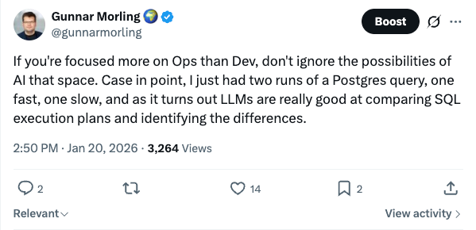
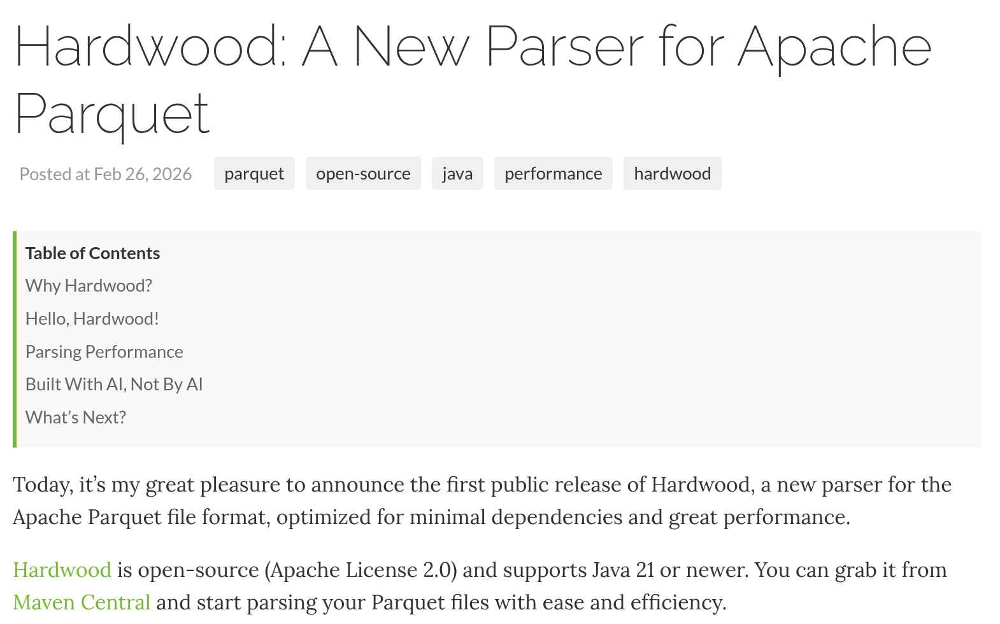

<!-- Slides cut from slides-cinderella.md, kept for Q&A or a longer slot. Not loaded by the deck. -->

<!-- .slide: class="hero-image" -->

## It was magic

  
  

Note:
Let the room feel the high; they felt it too in January.

A race condition found and fixed. A fast and a slow Postgres execution plan,
compared in seconds. Paste a hex dump, ask what's wrong, get the right answer.

---

<!-- .slide: class="hero-image" -->

Note:
"Every single time." The first few times, this is pure joy.

Remember this post. It comes back at midnight.

---

<!-- .slide: class="hero-image" -->

## …mostly

  
  

Note:
The cracks are there from the start, and at this point they're funny. Get the
laugh. Both of these come back.

---

<!-- .slide: class="hero-image" -->

## Seven weeks later

First commit Jan 4 · 1.0.0.Alpha1 on Maven Central Feb 26

Note:
The speed was real. Seven and a half weeks from "Initial import" to a first
release on Maven Central: a multi-threaded reader, nested schemas, all the
common encodings and codecs, and a row and a column API.

Point at the table of contents: "Built With AI, Not By AI" was already a
section in the very first release post.

---
