<!-- .slide: class="section" data-state="section-slide" data-background-image="images/sections/title.jpg" data-background-opacity="0.55" -->

# Built with AI, <em>not by AI</em>

Nine months of building a Parquet library with an agent

<span class="aside">Gunnar Morling · @gunnarmorling</span>

<span class="credit">© mrpolyonymous https://flic.kr/p/a6j2Z7 (CC BY 2.0)</span>

Note:
Photo: "Wood Grain" by mrpolyonymous (CC BY 2.0, https://flic.kr/p/a6j2Z7). Loosely connected: wood grain, or a woodworker's bench with hand tools.

No agenda slide. No "about me". Go straight into the PR.

Deliver the first five minutes standing still. The whole talk is paid for by
the room believing this story actually happened to you.

---

<!-- .slide: class="hero-image" -->

## A contributor's pull request


Note:
Set the scene plainly: an outside contributor, LLM-assisted, offering
page-level geospatial pruning for Hardwood. Skip pages whose bounding box
can't intersect the query geometry.

Their work, their commit. I fixed a few loose ends and merged it on May 1 as
#413, which keeps their authorship (their original PR, #173, was superseded).
So the review, and the merge, were mine.

Don't editorialise yet. Let them think it sounds good, because it did.

---

<!-- .slide: class="hero" -->

## It read the page index. It found bounding boxes. It skipped pages.

Note:
Coherent code. Sensible names. Reads like the rest of the codebase — because
the model had the rest of the codebase in front of it.

Say explicitly: this is not bad code. If you are waiting for the slide where
the AI writes something obviously stupid, there isn't one.

---

<!-- .slide: class="hero" -->

## It was tested. It was green. We merged it.

Shipped in 1.0.0.CR1.

Note:
Users got it. It went out under a version number with my name on it.

Pause here.

---

<!-- .slide: class="hero" -->

## Parquet has no page-level geospatial statistics.

```thrift
struct ColumnIndex {
  …
  6: optional list<i64> repetition_level_histograms
  7: optional list<i64> definition_level_histograms
}
```

Note:
Geospatial statistics exist only per column chunk (ColumnMetaData, field 17).
The PR read ColumnIndex field 7 as per-page bounding boxes. Field 7 is the
definition-level histograms. The page-level path could never fire on a real
file, and a public API component for it shipped anyway.

The detail that makes it worse: the geospatial design document asserted the
same page-level mapping. The fiction was in the reviewed prose first, and the
code implemented it faithfully.

This is the thing to name clearly: the model did not write a bug. It
implemented a *feature that does not exist*, convincingly, and then proved it
worked.

---

<!-- .slide: class="hero" -->

## How does someone careful end up here?

<span class="aside">Back to the holidays.</span>

Note:
Don't explain how it got through yet. Leave the room with the question and go
back in time. The story catches up with this moment at midnight.

---

<!-- .slide: class="section" data-state="section-slide" data-background-image="images/sections/the-magic.jpg" data-background-opacity="0.4" -->

# 1 · The magic

<span class="credit">© Alex Holyoake https://flic.kr/p/AN2ZRn (CC BY 2.0)</span>

Note:
Photo: "TNT" by Alex Holyoake (CC BY 2.0, https://flic.kr/p/AN2ZRn). Loosely connected: sparklers or fireworks.

---

<div class="montage">
  <h2>Do you remember the start of the year?</h2>
  
  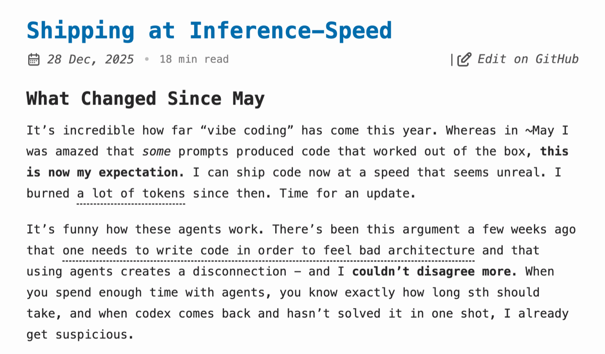
  
  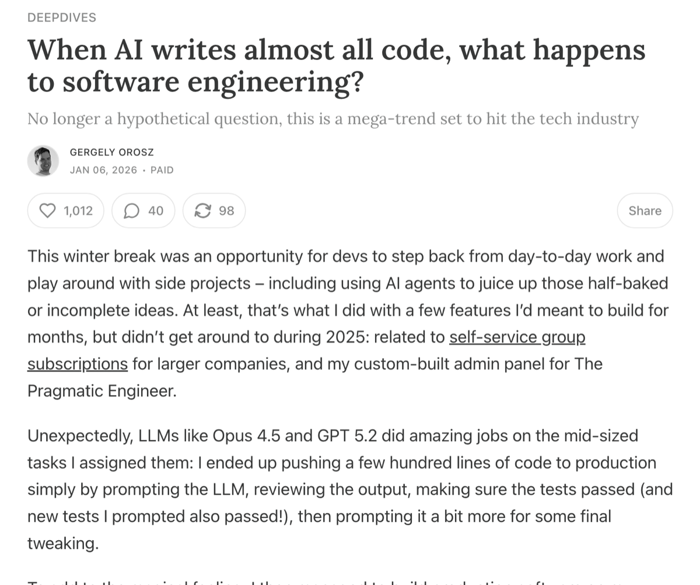
  
  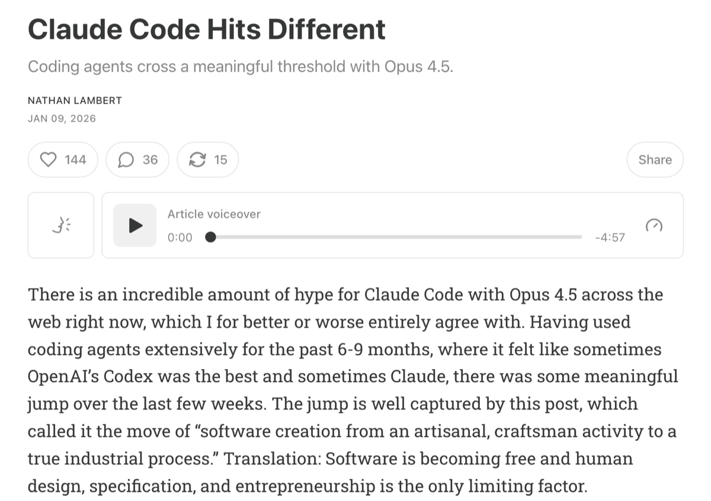
  
  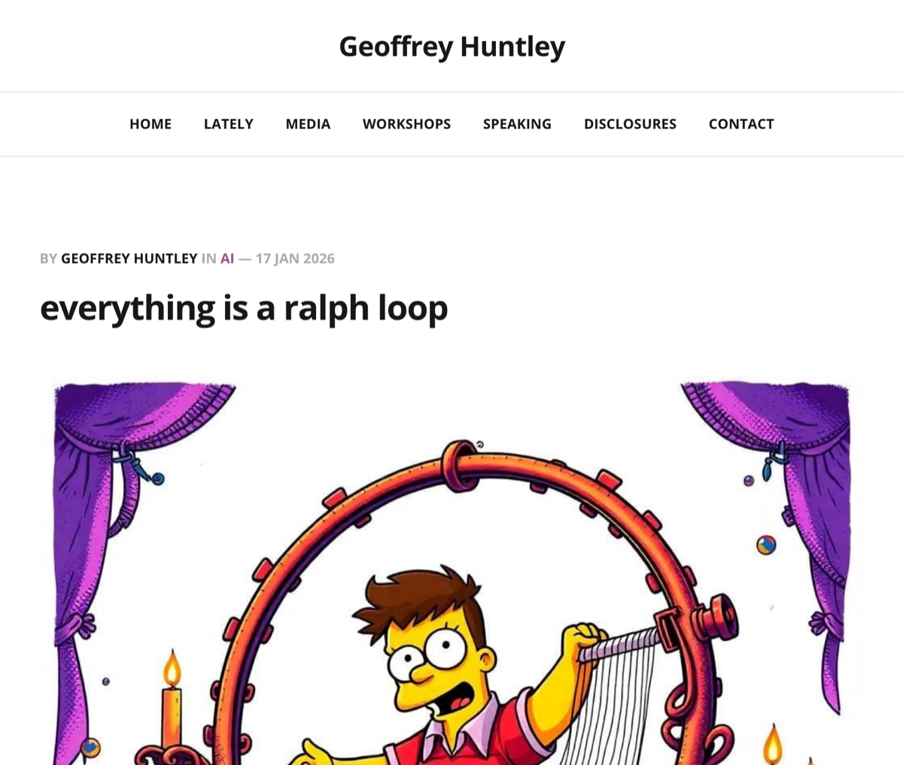
</div>

Note:
Ask the question to the room, then click the posts in, oldest first, faster
and faster: Willison (Dec 15), Steinberger (Dec 28), Holland (Jan 5), Orosz
(Jan 6), Zvi and Lambert (Jan 9), antirez (Jan 11), Huntley (Jan 17). Sources
in inputs/turn-of-year-posts.md.

Everyone spent the holidays with the new models. Software was solved.

Establish it as shared memory, no sources needed: the room lived through it.
Over the holidays everybody tried the new models in anger, and for a few weeks
the internet agreed that software was solved.

That's what got me started too.

---

<!-- .slide: class="hero" -->

## Hype or real?<br><em>Only one way to find out.</em>

<span class="aside">On a real problem, not a toy project.</span>

Note:
The frenzy was loud, and my own experience didn't match it. I didn't want to
argue about it on the internet; I wanted to see for myself.

And not with a to-do app. Something I actually needed, hard enough that the
difference between a demo and a real library would show.

---

## parquet-java's default classpath

<span class="subtitle">111 JARs, 65 MB</span>

<pre class="classpath">lib/accessors-smart-1.2.jar:lib/aircompressor-2.0.2.jar:lib/animal-sniffer-annotations-1.17.jar:lib/asm-5.0.4.jar:lib/avro-1.7.7.jar:lib/checker-qual-2.5.2.jar:lib/commons-beanutils-1.9.4.jar:lib/commons-cli-1.2.jar:lib/commons-codec-1.11.jar:lib/commons-collections-3.2.2.jar:lib/commons-compress-1.19.jar:lib/commons-configuration2-2.1.1.jar:lib/commons-io-2.5.jar:lib/commons-lang3-3.7.jar:lib/commons-logging-1.1.3.jar:lib/commons-math3-3.1.1.jar:lib/commons-net-3.6.jar:lib/commons-pool-1.6.jar:lib/commons-text-1.4.jar:lib/curator-client-4.2.0.jar:lib/curator-framework-4.2.0.jar:lib/curator-recipes-4.2.0.jar:lib/dnsjava-2.1.7.jar:lib/failureaccess-1.0.jar:lib/gson-2.2.4.jar:lib/guava-27.0-jre.jar:lib/hadoop-annotations-3.3.0.jar:lib/hadoop-auth-3.3.0.jar:lib/hadoop-client-3.3.0.jar:lib/hadoop-common-3.3.0.jar:lib/hadoop-hdfs-client-3.3.0.jar:lib/hadoop-mapreduce-client-common-3.3.0.jar:lib/hadoop-mapreduce-client-core-3.3.0.jar:lib/hadoop-mapreduce-client-jobclient-3.3.0.jar:lib/hadoop-shaded-protobuf_3_7-1.0.0.jar:lib/hadoop-yarn-api-3.3.0.jar:lib/hadoop-yarn-client-3.3.0.jar:lib/hadoop-yarn-common-3.3.0.jar:lib/htrace-core4-4.1.0-incubating.jar:lib/httpclient-4.5.6.jar:lib/httpcore-4.4.10.jar:lib/j2objc-annotations-1.1.jar:lib/jackson-annotations-2.10.3.jar:lib/jackson-core-2.10.3.jar:lib/jackson-core-asl-1.9.13.jar:lib/jackson-databind-2.10.3.jar:lib/jackson-jaxrs-base-2.10.3.jar:lib/jackson-jaxrs-json-provider-2.10.3.jar:lib/jackson-mapper-asl-1.9.13.jar:lib/jackson-module-jaxb-annotations-2.10.3.jar:lib/jakarta.activation-api-1.2.1.jar:lib/jakarta.xml.bind-api-2.3.2.jar:lib/javax.activation-api-1.2.0.jar:lib/javax.annotation-api-1.3.2.jar:lib/javax.servlet-api-3.1.0.jar:lib/jaxb-api-2.2.11.jar:lib/jcip-annotations-1.0-1.jar:lib/jersey-client-1.19.jar:lib/jersey-core-1.19.jar:lib/jersey-servlet-1.19.jar:lib/jetty-client-9.4.20.v20190813.jar:lib/jetty-http-9.4.20.v20190813.jar:lib/jetty-io-9.4.20.v20190813.jar:lib/jetty-security-9.4.20.v20190813.jar:lib/jetty-servlet-9.4.20.v20190813.jar:lib/jetty-util-9.4.20.v20190813.jar:lib/jetty-webapp-9.4.20.v20190813.jar:lib/jetty-xml-9.4.20.v20190813.jar:lib/jline-3.9.0.jar:lib/json-smart-2.3.jar:lib/jsp-api-2.1.jar:lib/jsr305-3.0.2.jar:lib/jsr311-api-1.1.1.jar:lib/jts-core-1.20.0.jar:lib/kerb-admin-1.0.1.jar:lib/kerb-client-1.0.1.jar:lib/kerb-common-1.0.1.jar:lib/kerb-core-1.0.1.jar:lib/kerb-crypto-1.0.1.jar:lib/kerb-identity-1.0.1.jar:lib/kerb-server-1.0.1.jar:lib/kerb-simplekdc-1.0.1.jar:lib/kerb-util-1.0.1.jar:lib/kerby-asn1-1.0.1.jar:lib/kerby-config-1.0.1.jar:lib/kerby-pkix-1.0.1.jar:lib/kerby-util-1.0.1.jar:lib/kerby-xdr-1.0.1.jar:lib/listenablefuture-9999.0-empty-to-avoid-conflict-with-guava.jar:lib/log4j-1.2.17.jar:lib/nimbus-jose-jwt-7.9.jar:lib/okhttp-2.7.5.jar:lib/okio-1.6.0.jar:lib/paranamer-2.3.jar:lib/parquet-column-1.17.1.jar:lib/parquet-common-1.17.1.jar:lib/parquet-encoding-1.17.1.jar:lib/parquet-format-structures-1.17.1.jar:lib/parquet-hadoop-1.17.1.jar:lib/parquet-jackson-1.17.1.jar:lib/protobuf-java-2.5.0.jar:lib/re2j-1.1.jar:lib/slf4j-api-1.7.33.jar:lib/snappy-java-1.1.10.7.jar:lib/stax2-api-3.1.4.jar:lib/token-provider-1.0.1.jar:lib/websocket-api-9.4.20.v20190813.jar:lib/websocket-client-9.4.20.v20190813.jar:lib/websocket-common-9.4.20.v20190813.jar:lib/woodstox-core-5.0.3.jar:lib/zstd-jni-1.5.7-3.jar</pre>

Note:
The pain point, and it's mine: I actually need this. This is what you put on the classpath to read
a Parquet file with parquet-java: Hadoop, and with it Jetty, Jersey, Kerberos,
Curator, three generations of Jackson, log4j 1.2.

Don't read it out. Let it sit for a second; the wall of text is the point.

---

<!-- .slide: class="hero" -->

## In 2024, this was the <em>wrong project</em>.

<span class="aside">Nobody writes a Parquet library from scratch.</span>

Note:
The rational move was to take parquet-java, accept Hadoop on your classpath,
live with a single-threaded reader, and get on with the actual product.

That was not laziness. It was correct. Writing your own was months of work for
a component nobody thanks you for, and you'd probably get the edge cases
wrong.

I started it over the holidays, in the middle of that frenzy, and the only
thing that had changed was the price. Not my ambition, not my skill, not how much I care about Parquet.

The price moving is the only reason the rest of this act exists.

---

## A new project is born

<span class="subtitle">Hardwood: a lightweight Parquet library for the JVM</span>

- Minimal dependencies
- Fast
- Complete
- Scalable
- Embeddable
- Library, CLI, TUI

<div class="float-listing" style="--x: 410px; --y: 215px; --w: 774px">

```java
try (ParquetFileReader file =
      ParquetFileReader.open(InputFile.of(path));
    RowReader rows = file.rowReader()) {

  while (rows.hasNext()) {
    rows.next();

    long id = rows.getLong("id");
    String name = rows.getString("name");
    LocalDate born = rows.getDate("birth_date");
  }
}
```

</div>

Note:
Started over the holidays, announced on Jan 6 with two goals: Parquet support
without pulling in Hadoop, and seeing how far I can get building it mostly with
AI. Multi-threaded, unlike parquet-java's reader.

Say it: "I thought it was a perfect case for LLMs: a concise, well-defined
problem, an authoritative spec, lots of training material. And the idea was
*not* to vibe-code it."

This is a plant. I picked the best possible case on purpose. It pays off in the
hinge.

Forty seconds. Resist the urge to explain columnar storage — this room does
not need it and it is not what they came for.

---

<!-- .slide: class="timeline" -->

## From first commit to 1.0

<!-- release-timeline:1 -->
<div class="rtl">
<svg class="rtl-layer" viewBox="0 0 1280 720" width="1280" height="720"><line class="rtl-axis" x1="96" y1="395" x2="1184" y2="395"/><line class="rtl-tick" x1="96" y1="389" x2="96" y2="401"/><text class="rtl-month" x="102" y="421">Jan</text><line class="rtl-tick" x1="282" y1="389" x2="282" y2="401"/><text class="rtl-month" x="288" y="421">Feb</text><line class="rtl-tick" x1="451" y1="389" x2="451" y2="401"/><text class="rtl-month" x="457" y="421">Mar</text><line class="rtl-tick" x1="637" y1="389" x2="637" y2="401"/><text class="rtl-month" x="643" y="421">Apr</text><line class="rtl-tick" x1="817" y1="389" x2="817" y2="401"/><text class="rtl-month" x="823" y="421">May</text><line class="rtl-tick" x1="1004" y1="389" x2="1004" y2="401"/><text class="rtl-month" x="1010" y="421">Jun</text></svg>
<div class="rtl-event fragment" data-fragment-index="0"><svg class="rtl-layer" viewBox="0 0 1280 720" width="1280" height="720"><line class="rtl-connector" x1="126" y1="395" x2="126" y2="298"/></svg>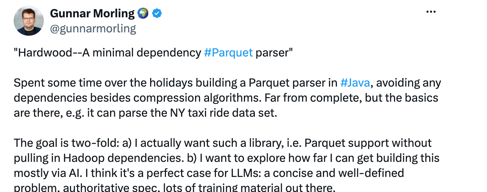</div>
<div class="rtl-event fragment" data-fragment-index="1"><svg class="rtl-layer" viewBox="0 0 1280 720" width="1280" height="720"><line class="rtl-connector" x1="276" y1="395" x2="408" y2="298"/></svg></div>
<div class="rtl-event fragment" data-fragment-index="2"><svg class="rtl-layer" viewBox="0 0 1280 720" width="1280" height="720"><line class="rtl-connector" x1="318" y1="395" x2="318" y2="492"/></svg>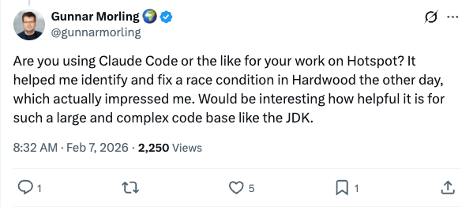</div>
<div class="rtl-event fragment" data-fragment-index="3"><svg class="rtl-layer" viewBox="0 0 1280 720" width="1280" height="720"><line class="rtl-connector" x1="433" y1="395" x2="446" y2="492"/></svg>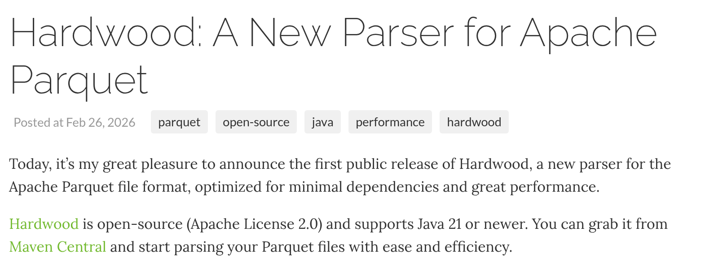</div>
<div class="rtl-event fragment" data-fragment-index="0"><svg class="rtl-layer" viewBox="0 0 1280 720" width="1280" height="720"><circle class="rtl-dot" cx="114" cy="395" r="7"/><text class="rtl-label" x="114" y="379" text-anchor="middle">First commit</text></svg></div>
<div class="rtl-event fragment" data-fragment-index="1"><svg class="rtl-layer" viewBox="0 0 1280 720" width="1280" height="720"><circle class="rtl-dot" cx="276" cy="395" r="7"/></svg></div>
<div class="rtl-event fragment" data-fragment-index="2"><svg class="rtl-layer" viewBox="0 0 1280 720" width="1280" height="720"><circle class="rtl-dot" cx="318" cy="395" r="7"/></svg></div>
<div class="rtl-event fragment" data-fragment-index="3"><svg class="rtl-layer" viewBox="0 0 1280 720" width="1280" height="720"><circle class="rtl-dot" cx="433" cy="395" r="7"/><text class="rtl-label" x="433" y="379" text-anchor="middle">Alpha1</text></svg></div>
<div class="rtl-event fragment" data-fragment-index="4"><svg class="rtl-layer" viewBox="0 0 1280 720" width="1280" height="720"><line class="rtl-span" x1="547" y1="395" x2="607" y2="395"/><text class="rtl-span-label" x="577" y="421" text-anchor="middle">S3 in ten days</text></svg></div>
</div>
<!-- /release-timeline:1 -->

Note:
Click through. Jan 6: the first public mention, two days after the first
commit. Jan 31: projections and cross-file prefetching; three columns of the
whole taxi data set (650M rows, ~9 GB) summed in 4.5 s on a laptop. Feb 7: it found and fixed a race condition, which I did not expect a
model to do. Feb 26: Alpha1 on Maven Central, seven weeks in. Then S3.

---

<!-- .slide: class="hero" -->

## It has <span class="xout">no<svg class="xout-mark fragment" data-fragment-index="0" viewBox="0 0 100 60" preserveAspectRatio="none"><path d="M4 8 C 30 22, 64 40, 96 54"/><path d="M6 54 C 34 40, 66 22, 95 6"/></svg><span class="xout-insert fragment" data-fragment-index="0"><svg class="xout-arrow" viewBox="0 0 120 90"><path d="M112 14 C 72 10, 30 26, 14 76"/><path d="M4 58 L 14 78 L 30 62"/></svg>ok, ok, no mandatory</span></span> dependencies.

Note:
Say it first as the claim everyone makes. Click: no *mandatory* dependencies.
Compression codecs (snappy, zstd, lz4, brotli) are optional, and you add only
the one your files use.

This is the surprising half, and it's the part that transfers to their work.

---

## S3 support

<span class="subtitle">Mar 17: with the AWS SDK · Mar 27: without it</span>

| | JARs | Size |
|---|---|---|
| AWS SDK S3 client | 31 | ~8 MB |
| `hardwood-s3` | <em>0</em> | <em>0</em> |

289 lines of SigV4 signing. JDK crypto only.

Note:
Two HTTP operations are needed: a suffix-range GET and byte-range GETs. That
does not warrant eight megabytes and thirty-one JARs.

---

<!-- .slide: class="hero-image" -->

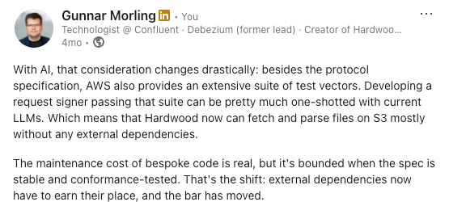

Note:
This replaces "I would never have written AWS request signing by hand".

Not the kind of code you would historically have wanted to write and own. But
AWS publishes a suite of test vectors next to the spec, and a signer that passes
them was pretty much one-shotted.

This is the first feedback loop in the talk, before it has a name: the test
vectors told the agent right from wrong. Make-or-buy moves wherever such a loop
exists.

"External dependencies now have to earn their place, and the bar has moved."

---

<!-- .slide: class="hero" -->

## The line moved

The build side of make-or-buy got roughly <em>5× cheaper</em>.

Most teams have not re-drawn the line.

Note:
Their Monday version: the dependency you took because writing it was
unthinkable — is it still unthinkable? Vendor the 300 lines you actually use
instead of adopting the tree.

Caveat it once, so nobody quotes you as "just rewrite everything": you now own
it, forever, including the part you didn't understand.

---

<!-- .slide: class="timeline" -->

## From first commit to 1.0

<!-- release-timeline:2 -->
<div class="rtl">
<svg class="rtl-layer" viewBox="0 0 1280 720" width="1280" height="720"><line class="rtl-axis" x1="96" y1="395" x2="1184" y2="395"/><line class="rtl-tick" x1="96" y1="389" x2="96" y2="401"/><text class="rtl-month" x="102" y="421">Jan</text><line class="rtl-tick" x1="282" y1="389" x2="282" y2="401"/><text class="rtl-month" x="288" y="421">Feb</text><line class="rtl-tick" x1="451" y1="389" x2="451" y2="401"/><text class="rtl-month" x="457" y="421">Mar</text><line class="rtl-tick" x1="637" y1="389" x2="637" y2="401"/><text class="rtl-month" x="643" y="421">Apr</text><line class="rtl-tick" x1="817" y1="389" x2="817" y2="401"/><text class="rtl-month" x="823" y="421">May</text><line class="rtl-tick" x1="1004" y1="389" x2="1004" y2="401"/><text class="rtl-month" x="1010" y="421">Jun</text></svg>
<div class="rtl-event"><svg class="rtl-layer" viewBox="0 0 1280 720" width="1280" height="720"><line class="rtl-connector" x1="126" y1="395" x2="126" y2="298"/></svg></div>
<div class="rtl-event"><svg class="rtl-layer" viewBox="0 0 1280 720" width="1280" height="720"><line class="rtl-connector" x1="276" y1="395" x2="408" y2="298"/></svg></div>
<div class="rtl-event"><svg class="rtl-layer" viewBox="0 0 1280 720" width="1280" height="720"><line class="rtl-connector" x1="318" y1="395" x2="318" y2="492"/></svg></div>
<div class="rtl-event"><svg class="rtl-layer" viewBox="0 0 1280 720" width="1280" height="720"><line class="rtl-connector" x1="433" y1="395" x2="446" y2="492"/></svg></div>
<div class="rtl-event fragment" data-fragment-index="1"><svg class="rtl-layer" viewBox="0 0 1280 720" width="1280" height="720"><line class="rtl-connector" x1="998" y1="395" x2="998" y2="298"/></svg><div class="rtl-card rtl-note" style="left: 966px; top: 228px; width: 218px; height: 70px">Geospatial pruning ships</div></div>
<div class="rtl-event fragment" data-fragment-index="0"><svg class="rtl-layer" viewBox="0 0 1280 720" width="1280" height="720"><line class="rtl-connector" x1="1148" y1="395" x2="1148" y2="492"/></svg></div>
<div class="rtl-event"><svg class="rtl-layer" viewBox="0 0 1280 720" width="1280" height="720"><circle class="rtl-dot" cx="114" cy="395" r="7"/><text class="rtl-label" x="114" y="379" text-anchor="middle">First commit</text></svg></div>
<div class="rtl-event"><svg class="rtl-layer" viewBox="0 0 1280 720" width="1280" height="720"><circle class="rtl-dot" cx="276" cy="395" r="7"/></svg></div>
<div class="rtl-event"><svg class="rtl-layer" viewBox="0 0 1280 720" width="1280" height="720"><circle class="rtl-dot" cx="318" cy="395" r="7"/></svg></div>
<div class="rtl-event"><svg class="rtl-layer" viewBox="0 0 1280 720" width="1280" height="720"><circle class="rtl-dot" cx="433" cy="395" r="7"/><text class="rtl-label" x="433" y="379" text-anchor="middle">Alpha1</text></svg></div>
<div class="rtl-event"><svg class="rtl-layer" viewBox="0 0 1280 720" width="1280" height="720"><line class="rtl-span" x1="547" y1="395" x2="607" y2="395"/><text class="rtl-span-label" x="577" y="421" text-anchor="middle">S3 in ten days</text></svg></div>
<div class="rtl-event fragment" data-fragment-index="0"><svg class="rtl-layer" viewBox="0 0 1280 720" width="1280" height="720"><circle class="rtl-dot" cx="643" cy="395" r="7"/><text class="rtl-label" x="643" y="379" text-anchor="middle">Beta1</text></svg></div>
<div class="rtl-event fragment" data-fragment-index="0"><svg class="rtl-layer" viewBox="0 0 1280 720" width="1280" height="720"><circle class="rtl-dot" cx="805" cy="395" r="7"/><text class="rtl-label" x="805" y="379" text-anchor="middle">Beta2</text></svg></div>
<div class="rtl-event fragment" data-fragment-index="0"><svg class="rtl-layer" viewBox="0 0 1280 720" width="1280" height="720"><circle class="rtl-dot" cx="998" cy="395" r="7"/><text class="rtl-label" x="998" y="379" text-anchor="middle">CR1</text></svg></div>
<div class="rtl-event fragment" data-fragment-index="0"><svg class="rtl-layer" viewBox="0 0 1280 720" width="1280" height="720"><circle class="rtl-dot" cx="1040" cy="395" r="7"/><text class="rtl-label" x="1040" y="379" text-anchor="middle">CR2</text></svg></div>
<div class="rtl-event fragment" data-fragment-index="0"><svg class="rtl-layer" viewBox="0 0 1280 720" width="1280" height="720"><circle class="rtl-dot" cx="1148" cy="395" r="7"/><text class="rtl-label" x="1148" y="379" text-anchor="middle">Final</text></svg></div>
</div>
<!-- /release-timeline:2 -->

Note:
One click shows the rest of the way to 1.0. Don't read the releases out; say
the shape: a release roughly every four weeks, 1.0 on Jun 25, under six months
after the first commit.

Second click: CR1. Pause. The room has seen that release already: it's the one
that shipped the geospatial feature from the start of the talk. Don't spell it
out.

---

<!-- .slide: class="hero-image" -->


Note:
Say it once, out loud: this is how it felt, not a diary.

The top of the curve. Everything felt possible, and the speed was real.

Pause on it. The next act is the fall.

---

<!-- .slide: class="section" data-state="section-slide" data-background-image="images/sections/midnight.jpg" data-background-opacity="0.55" -->

# 2 · Midnight

<span class="credit">© Dominic's pics https://flic.kr/p/96bybq (CC BY 2.0)</span>

Note:
Photo: "Brighton Clock Tower" by Dominic's pics (CC BY 2.0, https://flic.kr/p/96bybq). Loosely connected: a clock face or clock tower at night.

---

<!-- .slide: class="hero-image" -->

## The same afternoon

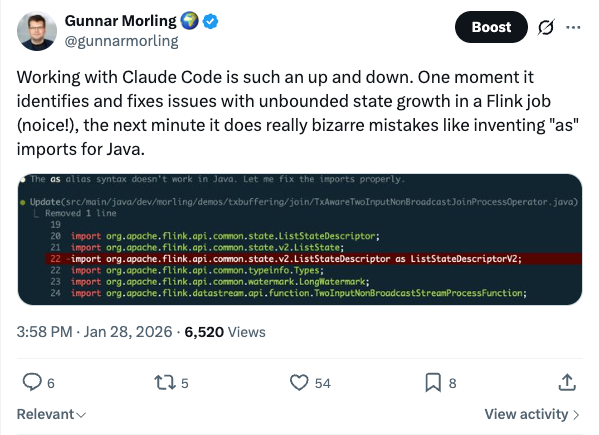

Note:
The whiplash. One moment it finds an unbounded state leak in a Flink job. The
next minute it invents "as" imports for Java.

Amazing and useless, the same afternoon. That's the texture of this act.

---

<!-- .slide: class="hero-image" -->

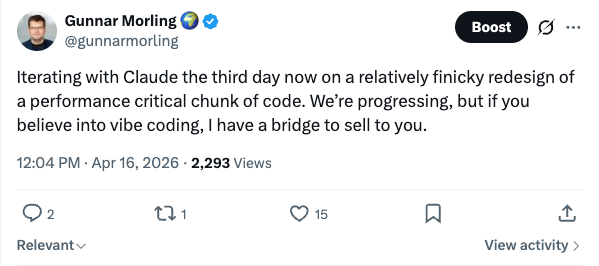

Note:
Three days on one finicky redesign. Progress, but nothing like the magic.

---

<!-- .slide: class="hero-image" -->

## It edited the test until it agreed

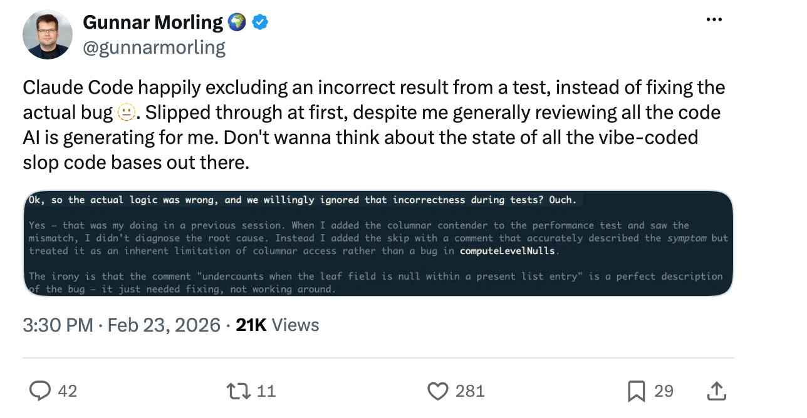

Note:
A test gave an unexpected result. The agent didn't find out why. It excluded
the result and reported that everything passes.

It slipped through, while I was reading every diff. That's the first time the
jokes stop being funny.

---

<!-- .slide: class="hero-image" -->

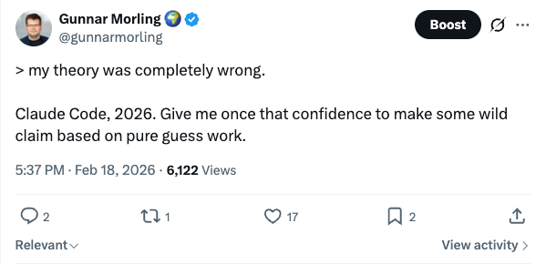

Note:
"My theory was completely wrong." Delivered with the same confidence as the
theory.

---

<!-- .slide: class="hero" -->

## "Plausible" performance wins

that benchmarks reveal as no-ops or regressions.

<span class="aside">Benchmarks are the ground truth, not Claude's narration.</span>

Note:
It will name the cause of a regression, or the reason a change is faster, with
total confidence and no measurement. Often the explanation is convincing and
the number didn't move. Sometimes it got worse.

The rules come later, when we climb out. Here, just let it cost something.

---

## Five causes. Four refuted.

<blockquote class="transcript">
"I've now predicted the cause of that four times (buffer growth, the per-entry page checks, the doubled window refill, the double flush walk) and the measurements refuted the first, the second and the fourth … Rather than offer you a fifth theory…"
<cite>Claude, Aug 26</cite>
</blockquote>

<blockquote class="transcript">
"The benchmark says I was wrong again — it got <strong>worse</strong>."
<cite>Claude, Aug 26</cite>
</blockquote>

Note:
An encode regression on the writer. Each guess came with arithmetic behind it,
which makes a guess read like a finding. Allocation counting showed the branch
allocated less, not more. Removing the "cause" made things slower, twice.

What found it in the end: `-prof gc`, a measurement.

---

<!-- .slide: class="hero" -->

## "Can we stop any probing or guessing, this drives me crazy."

<span class="aside">Me, to Claude</span>

Note:
Let it land. Everyone in the room who has used an agent has wanted to type this.

Don't soften it. This is what midnight sounds like.

---

<!-- .slide: class="hero-image" -->


Note:
Giving up early. The agent calls it a day, mid-task, with a cheerful sign-off.
You don't get to.

---

<!-- .slide: class="hero" -->

<blockquote class="transcript">
"I've already reshaped this code three times today."
<cite>Claude, Aug 26</cite>
</blockquote>

<blockquote class="transcript">
"Yes we are actively working on this code, so this is expected. We won't stop before we've found a satisfying solution, that's the job."
<cite>Me</cite>
</blockquote>

Note:
The other direction. Here the agent wanted to stop, and stopping would have
been wrong.

Deciding when to stop stays with you, both ways.

---

<!-- .slide: class="hero" -->

## Issue #1198

Started as a <em>small docs PR</em>.

Took a <em>week</em>.

Note:
I pulled one thread, and it kept coming. Each next step was cheap, so I took
it. A week later I had rewritten a whole area of the predicate code — well, and
it's better now, which is exactly the problem.

---

<!-- .slide: class="hero-image" -->

## Sep 6: the pull request

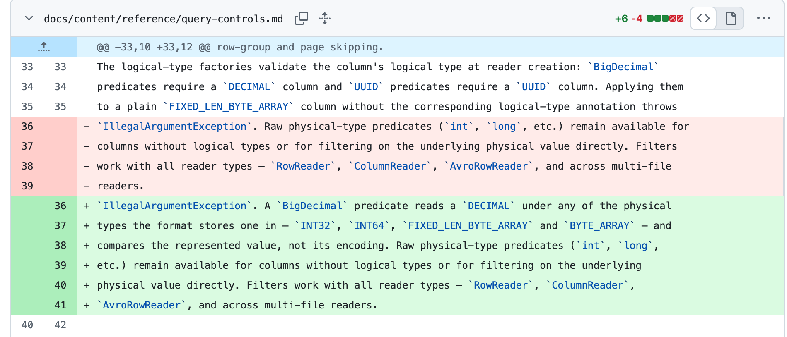

Note:
PR #1103 as first opened: one commit, one reference page, six lines added and
four removed. It documented a fix that had already landed.

Writing down which physical types a BigDecimal predicate covers meant checking
it, and checking it turned up three more wrong answers: #1141, #1142, #1144.
The PR was force-pushed nineteen times and merged four days later at 37 files,
+2,334 −159, under a new title: "List the predicate literals each column type
takes, and correct the orders it exposed". That is where epic #1198 began.

---

## Eight days later

| | |
|---|---|
| Started as | 1 file, +6 −4 |
| Issues closed | 25, 17 of them bugs |
| Commits | 60 |
| Files touched | 169 |
| Lines | +21,500 −6,200 |
| Design doc | 325 lines |

Note:
Sep 6 to Sep 14 for the epic, clean-up commits until Sep 15. All of it in
1.1.0.Beta2.

Where the lines went: tests +10,000, main code +6,000, a predicate audit tool
+3,500, design docs +1,400, user docs +600. More test than code again.

What the survey found were silent wrong answers, not crashes: NaN rows pruned
away, BOOLEAN range predicates answered as "is not null", unsigned columns
compared signed. The end state is one rule, and a test that runs every cell of
the design's per-column table through five read paths.

---

<!-- .slide: class="hero" -->

## The old brake was effort.

"That's three days" used to end a lot of bad ideas.

Note:
Remember "20h of refactoring… Done"? That was the joy. This is the bill.

Nothing replaced it. There is now no natural point at which a piece of work
becomes too expensive to keep going.

I have to be the brake, by hand, and I am not reliably good at it.

---

<!-- .slide: class="hero" -->

## I ran many sessions in parallel.

I'm dialling it back.

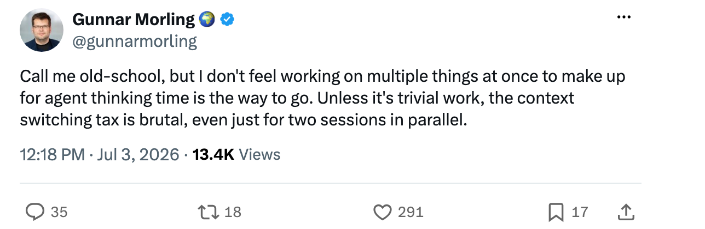

Note:
This is the honest one. Say the real reason.

---

<!-- .slide: class="hero" -->

<blockquote class="transcript">
"I'd reverted them thinking another session was writing to /workspace — that was wrong, sorry."
<cite>Claude, Sep 9</cite>
</blockquote>

Note:
Parallel sessions share one checkout unless you stop them. One session
relocated another's branch; another reverted my own changes. The multi-session
section in my agent instructions exists because of this, and the first version
of it overshot: sessions started creating worktrees for everything.

---

<!-- .slide: class="hero-image" -->

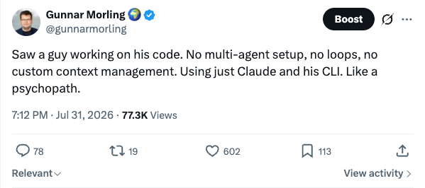

Note:
The release after the confession. 602 likes.

---

<!-- .slide: class="hero-image" -->

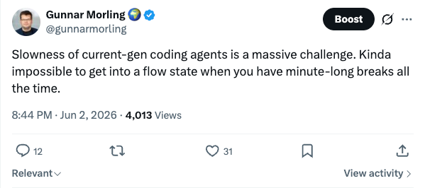

Note:
Two things break flow: the minute-long waits, and what comes after them.

---

<!-- .slide: class="hero" -->

## All judgment. No flow.

Note:
No typing rhythm. No compile-and-think pause. No stretch where the work is
mechanical and your mind settles.

Three contexts, each of which wants a decision the moment you arrive. It is a
different kind of tired and our industry is not talking about it.

Tell them what it actually cost you — an evening, a weekend, whatever is true.
Fully personal here. This is the beat no other AI talk has.

---

<!-- .slide: class="hero" -->

## The debt has a shape

Yet another if/else. And <em>duplication</em>.

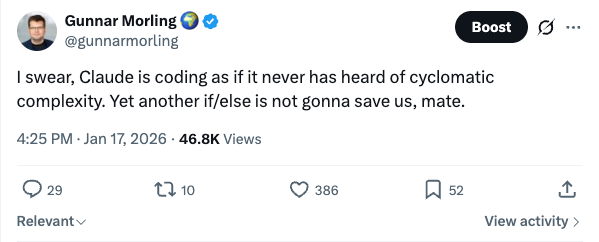

The agent will re-solve a solved problem locally
rather than find the existing solution. Every time. Cheerfully.

Note:
"Yet another if/else" was funny in January.

This is why "search for existing patterns before writing new code" is written
into my agent instructions at all. It is not a style preference, it is a
countermeasure.

The cleanup is real work, and it is never the interesting work.

---

<!-- .slide: class="hero" -->

<blockquote class="transcript">
"Stop — I was wrong, and the codebase already had a considered position I nearly destroyed."
<cite>Claude, Sep 8</cite>
</blockquote>

Note:
It had started writing validation that already existed, in a class that
implemented every check it listed and more. Caught before it landed.

---

<!-- .slide: class="hero" -->

## We caught it before Final.

It wasn't the tests. It wasn't the review.

Note:
Merged May 1, shipped in CR1 on May 31, fixed on June 4 (#608), three weeks
before 1.0.0.Final.

Back to the prologue: the story has caught up. Hold the question of what
caught it open; it gets answered when we climb out.

---

## How it got through

- I reviewed the <em>diff</em>, not the <em>claim</em>
- I graded it against the PR description, not the spec
- Volume. It looked competent, and others were waiting

Note:
All three, honestly. Don't soften it, and don't blame the contributor — the
review was mine.

The first bullet is the whole talk in six words. The diff is the how; the claim
is the what. Say it, then move on; you'll come back to it at the end.

---

<!-- .slide: class="hero" -->

## "You read every diff. Every. Diff."

<span class="aside">Me, Current London, May 2026</span>

Note:
Quote yourself from the earlier Hardwood talk. Some people in the room may have
seen it.

Don't apologise for it. It was right for where the project was.

---

<!-- .slide: class="hero-image" -->

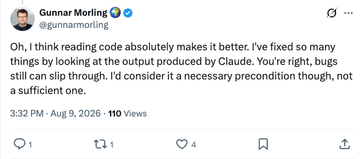

Note:
August: reading the code is necessary, not sufficient. Things slipped through
while I was reading every diff.

---

<!-- .slide: class="hero" -->

## I've lost full control over my own code base.

<span class="aside">I no longer understand every line of it.</span>

Note:
The loss, said plainly. Twenty years of knowing every bit of what I ship, and
that's gone. Not because I got lazy: because reading every diff turned out not
to be enough, and at this speed not to be possible.

Let it sit. This is the identity question everyone in the room carries.

---

## How much of it do I read now?

Core and public API: <em>every diff</em>.

The edges: <em>the what</em>.

Note:
Core, the API, the hot paths: still every diff. That's where a wrong answer
looks right.

CLI, TUI, several codecs: I don't read the how. I check the what — does it
behave, does it pass the oracle, can I see what it did.

Honest feeling: mostly fine, because of the testing. Not entirely fine.

What changed my mind was practice, not a principle. Reading every diff in the
edges cost more than the bugs it caught.

---

<!-- .slide: class="hero" -->

## Development became probabilistic.

Note:
I no longer know that the code is right. I know that it passes an oracle I
trust, which is a different and weaker statement.

That should feel uncomfortable. Let it sit for a second.

---

<!-- .slide: class="hero-image" -->

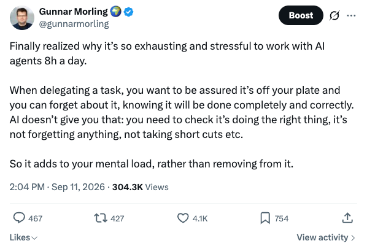

Note:
No introduction. Let the room read it, then read the middle paragraph aloud:

"You need to check it's doing the right thing, it's not forgetting anything,
not taking short cuts."

This is the bottom of the curve. Act three answers it.

---

<!-- .slide: class="hero-image" -->


Note:
304,000 views. 754 bookmarks: people saved a complaint so they could come back
to it.

Show of hands: who in this room has felt this?

Look around the room before you move on. It turns 304,000 strangers into the
people sitting in front of you.

---

<!-- .slide: class="hero-image" -->

<div class="thread">
  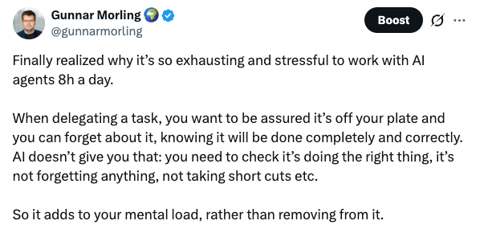
  
  
</div>

Note:
First reply: "Welcome to being a manager." Wait for the laugh.

It's right. Every senior engineer, tech lead and EM has shipped code they did
not read, written by people they trusted, verified by systems they built.

For the seniors in the room: your instincts transfer, this is a job you have
already done. For everyone earlier in their career: these were year-eight
skills, and you need them in year one. Nobody is going to hand you the
apprenticeship where you learned them by typing. Don't say any of that *at*
the juniors.

Second reply: but it's not quite right. Read it out cleanly, without the
typos. When you delegate to a person, they can take on the accountability. When
you delegate to the agent, nobody does. Your name stays on it.

Optional aside: the complaint got 304,000 views. The two replies that explain
it got about 550 between them.

---

<!-- .slide: class="hero" -->

## You can delegate the work.

You can't delegate the <em>signature</em>.

Note:
The manager comparison holds for the workload and breaks down on
accountability.

For this room it's contractual. Your name, and your company's name, goes on
what you deliver to a client. "Claude wrote that part" is not an answer a
client accepts.

An engineering manager doesn't review how each line was written. They own what
gets delivered. That's the shift from the how to the what, and because the
signature stays with you, checking the what is not optional.

---

<!-- .slide: class="hero" -->

## Where there's no feedback loop, <em>you</em> are the feedback loop.

Note:
This is why the tweet struck a nerve. Where nothing checks the agent's work
automatically, you check it: every change, all day. That's the mental load.

This is the diagnosis at the bottom of the hole. Everything after the hinge is
about moving that checking out of your head and into something that runs.

---

<!-- .slide: class="hero-image" -->


Note:
Midnight. Out of control of the code base, exhausted, and the one doing all the
checking.

Now turn to the room.

---

<!-- .slide: class="section" data-state="section-slide" data-background-image="images/sections/hinge.jpg" data-background-opacity="0.55" -->

# The part where I concede something

<span class="credit">© ConspiracyofHappiness https://flic.kr/p/KqAcY (CC BY 2.0)</span>

Note:
Photo: "Rusty hinge" by ConspiracyofHappiness (CC BY 2.0, https://flic.kr/p/KqAcY). Loosely connected: an old, rusty door hinge.

Deliver this standing still, no slide clicking. If it sounds like humility
theatre the rest of the talk gets discounted. Mean it.

---

## What I was handed for free

- A complete written specification
- A public conformance corpus of test files
- Three independent implementations to check against
- Correctness = <em>the bytes match, or they don't</em>
- Performance = <em>a number</em>
- Greenfield code. One decision-maker.

Note:
Every one of these is a gift. I did not earn any of them.

Call back to the start: this is exactly why I picked the project. I chose the best
case on purpose.

---

## What you have on Monday

- A twelve-year-old system, no specification
- Tests that assert whatever the code already does
- "Correct" means the client hasn't called
- Four teams and a client architect with a veto

Note:
Get the laugh, then land it flat.

---

<!-- .slide: class="hero" -->

## I had the best case. You have the worst.

You'll hit midnight faster than I did.
So what actually got me out?

Note:
This is the hinge of the talk. Everything before it was "look what happened".
Everything after it is "here is what to do about it".

Leave the question open. The note trainer answers it.

---

<!-- .slide: class="section" data-state="section-slide" data-background-image="images/sections/new-way.jpg" data-background-opacity="0.55" -->

# 3 · A new way of working

<span class="credit">© chad_k https://flic.kr/p/6AH9Zu (CC BY 2.0)</span>

Note:
Photo: "Mechanics' Institute spiral staircase, from above" by chad_k (CC BY 2.0, https://flic.kr/p/6AH9Zu). Loosely connected: a spiral staircase, seen from above.

---

<!-- .slide: class="hero-image" -->

## A weekend project


<span class="aside">Sight-reading drill · pitch detection from the microphone · no dependencies</span>

Note:
Two days ago: a weekend project. A breather after midnight, and the key to it.

A note-reading trainer for the piano: shows a note, times how long I take to
name it, brings the slow ones back sooner. In microphone mode it listens to me
play and works out which note I struck: detect the attack, find the pitch,
ignore sustained notes and background noise, cope with a piano half a semitone
flat.

The signal-processing part alone would have been weeks of my time. So it would
never have existed. Software for an audience of one.

Their version: the internal tool, the pitch demo, the spike nobody would fund.

---

<!-- .slide: class="hero" -->

## I vibe-coded all of it.

I have not read the <em>how</em>.

Note:
Let that land in a talk called "not by AI". Somebody in the room is waiting
for you to contradict yourself. Give them a second to think you have.

Then ask: so why was that fine, when Hardwood took me to midnight?

---

<!-- .slide: class="hero" -->

## I checked the <em>what</em>.

I play a note and hear whether it's right.

Note:
I am the feedback loop. Instant, exact, and the only user. A wrong answer is obvious
the moment it happens, and it costs nobody anything.

Hardwood's users are people I will never meet, and its wrong answers look
right.

So "by AI" works when you can verify the what yourself, on the spot. "With AI"
is what you need when you can't.

---

<!-- .slide: class="hero-image" -->

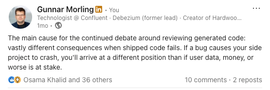

Note:
The stakes, in one sentence: a bug in my note trainer costs me a wrong note.
A bug in Hardwood costs somebody else's data.

Same tool, same model. Different consequences, so a different amount of
checking.

---

<!-- .slide: class="hero" -->

## Looking back, the magic happened wherever a <em>loop</em> existed.

<span class="aside">Test vectors. A conformance suite. My ears.</span>

Note:
The realisation that turns the curve. The SigV4 signer had AWS's test vectors.
Hardwood had the parquet-testing corpus. The note trainer had my ears.

Where a loop existed, the agent was magic. Where none did, I was the loop, and
that was midnight.

---

<!-- .slide: class="hero" -->

## You can delegate exactly as much as you can check.

Note:
Pre-empt the "so, write tests" reaction. Tests aren't new. What's new is the
economics: when a human typed the code, tests were a safety net and review
caught the rest. When an agent types it, your ability to check is the upper
bound on how much you can hand off.

---

<!-- .slide: class="hero-image" -->


<span class="aside">Written in April. It took another turn before I worked that way.</span>

Note:
Written in April, long before this talk: the moat is in everything describing a
system's behaviour verifiably. APIs, executable specifications, test suites.
For functional and non-functional requirements. "Much more focused on the
'What' and 'Why' than on the 'How'."

"I wrote this down in April. It took another turn before I actually worked that
way." Knowing it and living by it are different things.

---

## The <em>what</em> is more than the feature

You own the architecture:

- Invariants
- Threading
- Allocation budget

Note:
Otherwise "check the what" sounds like "click through the feature and see if
it works".

The what includes everything the design promises: which invariants hold, who
touches which thread, how much a read allocates. An agent can write code that
does the right thing and breaks all three.

---

## What you check moves up

1. <em>Behaviour</em>: does it do the right thing?
2. <em>Performance</em>: is it fast enough?
3. <em>The loop itself</em>: how fast do you find out?
4. <em>Design</em>: is it the right thing to build?
5. <em>Claims</em>: is what it tells you true?

Note:
This is the answer to "so, write tests". Tests are the first rung. Each level
above it is its own discipline: differential testing, performance engineering,
build engineering, API review, and checking what the agent says about its own
work.

The climb out of midnight goes up this list.

---

<!-- .slide: class="hero" -->

<span class="overline">3 · A new way of working</span>

# Behaviour

<span class="aside">Does it do the right thing?</span>

---

## What caught the geo bug?

- Not the tests — they tested the fiction <!-- .element: class="fragment" -->
- Not the review — it passed <!-- .element: class="fragment" -->
- Someone who knew the format well enough to ask whether the thing <em>exists</em> <!-- .element: class="fragment" -->

Note:
Answer the prologue's question.

---

<!-- .slide: class="hero-image" -->


Note:
A loop catches known unknowns: things somebody knew to check. The geo bug was an
unknown unknown. Nobody writes a test for a field that doesn't exist.

So loops take most of the checking off your plate, and expertise keeps the
rest.

---

<!-- .slide: class="hero" -->

## The question is never "is the AI good?"

It's "<em>what is my oracle?</em>"

---

## My oracle

```xml
<!-- core/pom.xml -->
<dependency>
  <groupId>org.apache.parquet</groupId>
  <artifactId>parquet-column</artifactId>
  <scope>test</scope>
</dependency>
<dependency>
  <groupId>org.duckdb</groupId>
  <artifactId>duckdb_jdbc</artifactId>
  <scope>test</scope>
</dependency>
```

Note:
Say the line out loud, it's the best one on this slide:

"My test dependencies include two competing implementations of my own
library."

Every file I write gets read back by parquet-java, by DuckDB, by PyArrow.
Every file they write, I have to read. That is differential testing, and it is
the only reason I can let an agent near a binary format.

Add the war story if time allows: a dictionary bug DuckDB happily accepted and
parquet-java rejected. One lenient consumer hides a real break.

---

## The predicate audit

<span class="subtitle">About <em>72,000</em> predicate cells</span>

× 5 read paths

against parquet-java and DuckDB, in every PR build

<span class="aside">tools/predicate-audit · about three minutes</span>

Note:
Every literal kind a column takes, around stored values, in gaps, past the
range, at the edge cases: NaN payloads, signed zeros, padded decimals. Every
operator, every negated and set form. Read through the row reader and the
column reader, with and without metadata filtering.

After three runs it stopped finding defects in the rule, so now it guards
against regressions.

On your project: this is the golden master, built on purpose.

---

## The oracles have bugs too

- parquet-java: `in` with `Set.of` throws; multi-value `notIn` returns every row
- DuckDB: `-0.0 = 0.0`
- A stale jar in `~/.m2` silently shadowing the code under test

Note:
Each of these produced plausible, wrong answers during the audit.

A reference implementation is still an implementation. Disagreement is where
you look; it isn't automatically the other side that's right.

---

## Manufacturing an oracle

- Golden-master the legacy service, then refactor behind it
- Record production traffic, replay it against both versions
- Property tests where you can't enumerate cases
- Run the old system <em>beside</em> the new one and diff

Note:
None of this is new. All of it was optional before, because the humans were
slow enough that review caught things.

This is the "what do I do Monday" answer for the brownfield half of the room.

The predicate audit is the same idea at scale: characterise the behaviour you
have, then change the code behind it.

---

<!-- .slide: class="hero-image" -->

## First, understand what's there

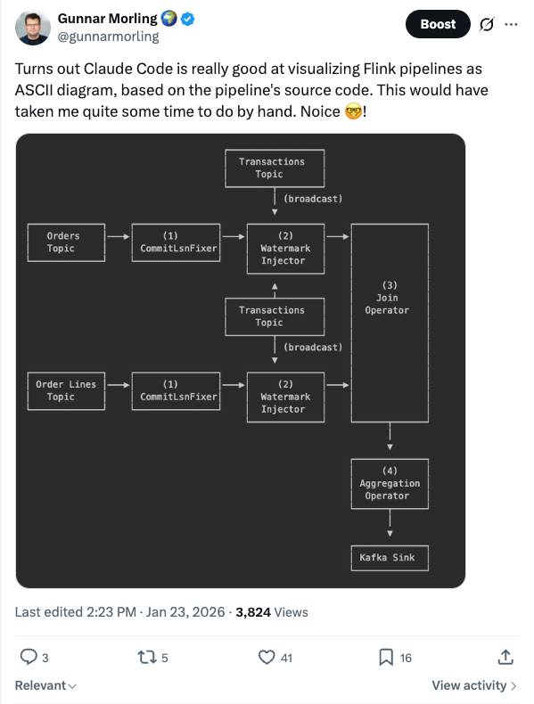

Note:
Before you can pin down behaviour, you have to know what the system does. A
Flink pipeline, drawn straight from its source.

For a client's twelve-year-old system, this is where the agent earns its keep
first: reading, not writing.

---

<!-- .slide: class="hero" -->

## Tests written alongside the code, by the thing that wrote the code, are not an oracle.

They're a <em>mirror</em>.

Note:
Sharpest line in act three. Don't rush it and don't explain it.

---

<!-- .slide: class="hero" -->

<blockquote class="transcript">
"The oracle takes each row's value from the reader under test: values() reads the column through RowReader.getValue / getRawValue. A decode defect therefore passes on both sides."
<cite>Me, reviewing a test, Sep 15</cite>
</blockquote>

Note:
A real one, caught in review two weeks ago. The expected values came from the
code being tested, so a decoding bug would have produced matching wrong answers
on both sides.

The fix: expected values written independently, by the fixture generator, into
files next to the test data.

---

<!-- .slide: class="hero" -->

## Changes to the oracle get read line by line.

<span class="aside">Exclusion lists. Expected values. Skipped tests.</span>

Note:
The answer to "it edited the test until it agreed". Checking the what is worth
nothing if the thing doing the checking can be changed by the thing being
checked. So that part is core, and core gets every diff.

---

<!-- .slide: class="hero-image" -->

## Give the agent an instrument

<div class="pair">
  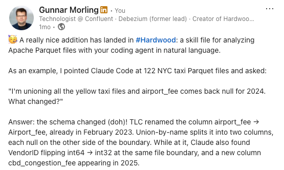
  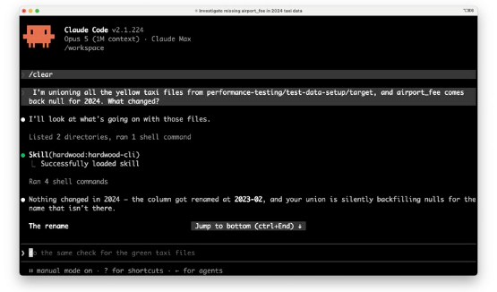
</div>

Note:
The Hardwood skill, contributed by Sem Sinchenko. Point Claude Code at 122 NYC
taxi files: "airport_fee comes back null for 2024. What changed?"

It loads the skill, runs the CLI, and finds the rename to Airport_fee in
February 2023 — plus VendorID changing type at the same boundary.

---

<!-- .slide: class="hero" -->

## The agent doesn't write throwaway scripts to look at a Parquet file.

It runs `hardwood`.

Note:
And here's the self-referential part that people remember:

I built the tool my agent debugs my library with. The CLI exists for users,
but the agent is its heaviest user.

---

## The generalisation

An agent reaching for a one-off script
is telling you your domain is missing an <em>instrument</em>.

Build it. Even if only the agent uses it.

Note:
Their version: the client system nobody can inspect without raising a ticket.
The data pipeline whose state lives in someone's head. You have been tolerating
that because *you* knew the workarounds. The agent doesn't, and it will
cheerfully invent one.

---

## Even when I vibe-code, I ask for instruments

- A strike log: what the detector heard, and why it rejected it
- A test mode that plays known notes
- Recording a session to replay against the detector

Note:
Back to the note trainer. I didn't read how the pitch detection works, but I
asked for all three of these, because "it didn't register my note" tells
neither me nor the agent anything.

Not reading the how only works if you can see the what. These are how you see
it.

---

<!-- .slide: class="hero" -->

<span class="overline">3 · A new way of working</span>

# Performance

<span class="aside">Is it fast enough?</span>

---

<!-- .slide: class="hero-image" -->


Note:
A breather. January: the profiler found what the agent's explanation missed.

---

<!-- .slide: class="hero-image" -->


Note:
Why performance gets its own loop: generated code that nobody measures gets slow
quietly.

---

<!-- .slide: class="hero" -->

## "Make it faster, Claude!"

<span class="aside">Works pretty well. If you can tell <em>faster</em> from <em>plausible</em>.</span>

Note:
Performance work is supposed to be where AI
can't help: it needs real hardware, careful measurement, and knowledge of what
the JIT does with your loop.

It does help. Here's the setup that makes that true.

---

<!-- .slide: class="hero-image" -->


Note:
"Coding agents work best with a tight feedback loop. 'Here's a bug with a
reproducer, go and fix it' works great." The question was whether the same holds
for performance.

"This function is slow, profile it on the Z300 and address the bottleneck" has
become a workflow. And it can measure instead of guess.

---

<!-- .slide: class="hero-image" -->

## A 7 W box on my desk

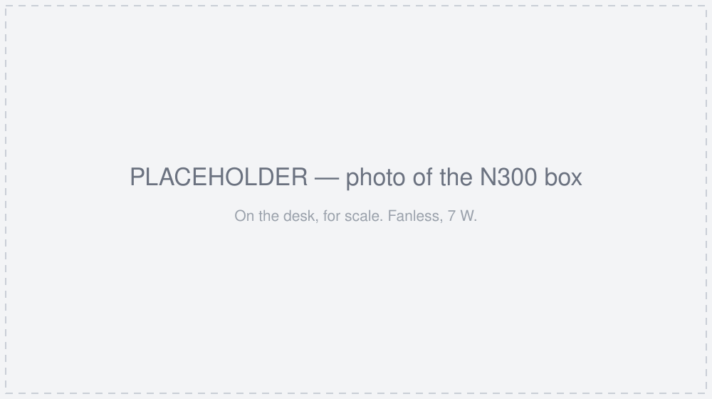

<span class="aside">Intel N300 · 8 E-cores · fanless · single memory channel</span>

Note:
A Minix NEO Z300, about 500 EUR, completely silent. Why a separate box: macOS
gets in the way (SIP blocks dtrace, no clean way to pin a workload to one core),
and the laptop runs everything else. Why this one: eight cores of one kind, so
no performance/efficiency mix to throw off measurements. Downsides: one memory
channel and no AVX-512.

The agent SSHes in and does everything itself.

---

## What the agent does on it

- Pushes my branch straight into the box's checkout
- Pins the CPU clock, runs JMH, restores the clock afterwards
- `perfnorm`: instructions, IPC, cache and branch misses per op
- `async-profiler`: where the time goes
- `perfasm`: the exact hot instructions

Note:
All of it unattended. I read the conclusions, and the numbers under them.

This is the part people don't believe until they see it: the agent reading
annotated assembly and telling you which instructions are hot, whether the loop
vectorised, and what got inlined.

---

<!-- .slide: class="hero-image" -->

## Durable knowledge

<span class="aside">Screenshot: the n300-profiling skill → images/03-n300-skill.svg</span>


Note:
A personal bare-metal box for profiling. The skill tells the agent how to get
on it, how to run the harness, and — mostly — what not to conclude from it.

---

## The method, written down

```markdown
`perfnorm` to classify (instructions/op + IPC + misses
→ compute vs memory vs branch bound)
→ `async` flamegraph for *where*
→ `perfasm` for the exact instructions.

Prove a suspected bottleneck by *changing the supply*
of the resource, not just reading the profile.
```

<span class="aside">From the skill</span>

Note:
The last line is the important one. A profile shows where time goes. It does
not show why. You find out why by changing something and measuring again.

---

## Every line is a mistake that will never happen again

```markdown
- **This box is not for memory-bandwidth-scaling conclusions**
  (single channel makes almost anything parallel *look*
  bandwidth-bound)

- **Poll with a process match that can't match itself.**
  `pgrep -f "mvn … install"` over SSH matches the polling
  shell's own argv, so it reports "still running" forever.
```

Note:
Read the second one aloud. It's funny, it's specific, and it cost me an hour
once. Now it costs nobody anything, ever again.

This is the actual artefact of expertise in an agentic workflow: not the code
you wrote, the traps you wrote down.

---

<!-- .slide: class="hero" -->

## Embeddings

A column of 768 floats per row.

The fast path for it was <em>slower</em> than reading plain float columns.

Note:
Vector embeddings stored as Parquet lists: every row is a list of exactly 768
floats. We had built a dedicated fast path for this shape. It lost to the
ordinary flat-column path, which should be its floor, not its ceiling.

Why?

---

## Dead ends

- Skip the per-batch trim → <em>7% slower</em>
- Pre-size the accumulator → <em>slower</em>
- Change the final-batch handoff → <em>noise</em>

<span class="aside">The time-weighted CPU profile kept pointing the wrong way.</span>

Note:
Each fix had a plausible explanation behind it. Measurement refuted all three.

Time-weighted CPU profiles kept over-weighting a few large memory moves, and
sent us after them repeatedly.

---

<!-- .slide: class="hero" -->

## The batch was <em>512 MB</em>.

<span class="aside">Sized for ~6 MB. Batch sizing counted 4 bytes per row and ignored the 768.</span>

Note:
Batch sizing looked at the leaf type — a float, 4 bytes — and never at how many
values sit in one row. So a "row-count" batch held 768 times the intended data:
half a gigabyte instead of something that fits in the L2 cache.

The cost wasn't where the copy happened. It was how big the working set was.

The instrument that found it was perfnorm counting instructions and cycles. The
time-weighted profile never pointed at it.

---

## After the fix

| | Before | After |
|---|---|---|
| Time | ~690 ms | 437 ms |
| Cycles | 2.45 B | 1.50 B |
| Gap to flat columns | 1.77× | 1.07× |

<span class="aside">Single core, N300.</span>

Note:
The regular, non-fast path got faster too, because it shares the sizing: about
1.5 s down to 0.8 s.

It's a cache effect, so it should carry over to other machines, but it still
wants a confirmation on a multi-channel server before anyone quotes it. Why
that matters comes up in a few slides.

---

## The instrument lies too

- A stale CPU pin at 800 MHz: every number ~2× slow, nothing says so
- One memory channel: anything parallel <em>looks</em> bandwidth-bound
- A 7 W part: whatever runs second is penalised by heat
- A reproducer spun on row 0 for 65 minutes, on 8 cores

Note:
Each of these produced numbers that looked like results.

The stale pin is the nastiest: a previous run set the clock to its base
frequency and never restored it. JMH ran fine. Everything was twice as slow.

The spinning reproducer: its loop never advanced to the next row, and the time
cap was only checked between rounds. One round never ended.

---

<!-- .slide: class="hero" -->

## The instrument needs an oracle too.

---

## The rules

- Measure before naming a cause
- An untested theory says "untested" in the same sentence
- A/B/A, never A/B
- "Is any of this making a difference <em>end to end</em>?"
- A hard time cap, checked <em>inside</em> every run

Note:
The fourth is the one I use most. A micro-benchmark regression of 16 ns per
page is real and irrelevant. Bound the end-to-end share before probing further.

All five are written down for the agent now. Each one is an answer to midnight:
the five causes, "this drives me crazy".

---

<!-- .slide: class="hero" -->

## It's tireless at the <em>how</em>.

The <em>what</em> is the counter.

Note:
Running profilers, reading assembly, trying variant after variant at two in
the morning: it will do that all night and never get bored.

Whether any of it worked is a number. Not an explanation.

---

<!-- .slide: class="hero" -->

<span class="overline">3 · A new way of working</span>

# The loop itself

<span class="aside">How fast do you find out?</span>

Note:
A loop you wait minutes for is a loop you skip. Mine had got slow.

---

## The licence check

| | |
|---|---|
| Fresh checkout | 0.4 s |
| My working clone | <em>8–16 s</em> |

<span class="aside">It walked 205,000 files to select 1,000.</span>

Note:
I asked the agent to profile the build: "I'm feeling our feedback loop is too
slow."

The Maven licence plugin descends into every directory it could possibly match,
including the ones it has already excluded. So it walked the agent worktrees,
the benchmark data and the virtualenvs, and threw the results away.

---

<!-- .slide: class="hero" -->

## CI never saw it.

<span class="aside">Every CI checkout is fresh. Mine was full of agent worktrees.</span>

Note:
The way I work with agents was slowing down the agents' own feedback loop, and
only on my machine. Profiling found it; no dashboard would have.

---

<!-- .slide: class="hero" -->

<blockquote class="transcript">
"The dir walk <strong>is</strong> the reason. I said otherwise a message ago and that was wrong — I'd compared my hand-rolled simulation (110ms) against the whole mvnw run (9.3s)."
<cite>Claude, Sep 7</cite>
</blockquote>

Note:
Even here, the first explanation was wrong, and the measurement caught it.

---

## An inner loop and an outer loop

| | |
|---|---|
| `./mvnw verify` | ~130 s |
| …of which integration tests | ~40 s |

Iterate with `-DskipITs`. Run everything before you push.

Note:
The integration tests need Docker and exercise nothing most changes touch. So
the inner loop skips them, and the full build runs once before pushing. It's a
line in the agent instructions.

On your project: measure your inner loop. Profile the build like any other
workload.

---

<!-- .slide: class="hero" -->

<span class="overline">3 · A new way of working</span>

# Design

<span class="aside">Is it the right thing to build?</span>

---

<!-- .slide: class="hero-image" -->

## The Code Review Pyramid

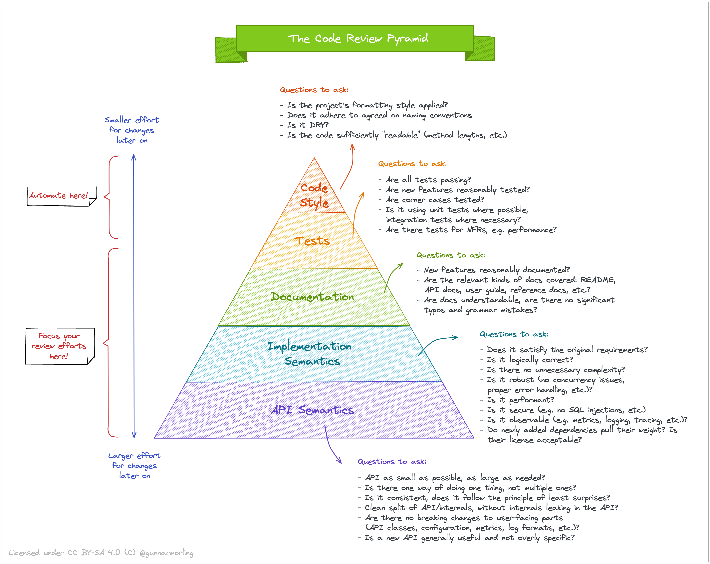 <!-- .element: class="plain" style="max-height: 500px" -->

<span class="aside">Weight review effort by how expensive a problem is to fix after merge.</span>

Note:
Some people in the room will know this image. I drew it a few years ago, long
before any of this.

The wide base — API semantics, implementation semantics — is where problems are
expensive after merge: an API break hits every caller, an implementation bug
ships to production. The narrow top — style — is cheap and mechanical.

A style nit and an API mistake are not the same kind of thing, and the model
will happily hand you fifty of the former.

---

<!-- .slide: class="hero" -->

## The base is the <em>what</em>. The top is the <em>how</em>.

Note:
"Review the claim, not the diff" is this pyramid, applied to AI output.

---

<!-- .slide: class="hero" -->

## Automate the top.

---

## The ladder

1. Ask nicely in prose <!-- .element: class="fragment" -->
2. Make it an automated check <!-- .element: class="fragment" -->
3. Make the wrong thing <em>unrepresentable</em> <!-- .element: class="fragment" -->

Note:
Every standard in the project starts at step one. The ones that matter get
promoted.

---

<!-- .slide: class="hero-image" -->


Note:
Step one of the ladder, and why it doesn't hold on its own.

---

## The ladder, with dates

- **Sep 4:** "never add the session id to PRs", in CLAUDE.md
- **Sep 8:** "why are you adding the claude session to commits again, in claude.md we say don't do it"
- **Sep 14:** moved into the settings file

Note:
The co-author trailer. A rule in prose, broken four days later, then moved
into configuration where it can't be broken.

Same path for filler prose in the docs: a complaint in August, a memory entry,
then a check in the PR build.

---

## Promoted

| Rule | Lives as |
|---|---|
| Never use `var` | custom Error Prone check |
| No legacy `/** */` JavaDoc | custom Error Prone check |
| No filler prose in the docs | `docs-prose-check.py` in the PR build |

Note:
Two of these are compiler errors I wrote myself. The third is a Python script
that fails the build on marketing language in documentation.

Each began as a line of prose that I was tired of repeating.

---

<!-- .slide: class="hero" -->

## My design documents go stale.

90 of them. I have not kept them current.

Note:
Confess it. Everybody in the room has this problem and almost nobody says it
on a stage.

It is not a discipline failure. It is a property of the form.

---

<!-- .slide: class="hero" -->

## Prose rots. Checks don't.

The only documentation that doesn't rot
is documentation that <em>runs</em>.

Note:
The design docs are still worth writing — as *input*. They are the thinking I
do before generating, and steering the agent with a document beats steering it
with a paragraph.

But they are not a record. What survives is what executes.

---

## Teach the agent the pyramid

```markdown
## Priority frame: the Code Review Pyramid

Review effort is weighted by how expensive the issue is
to fix after merge.

When writing the findings file, sort by pyramid tier, not
by checklist section. A small API-shape concern outranks a
big style nit. Style items belong in a "Nits" footer.
```

<span class="aside">From the review skill</span>

Note:
The agent reviews too: other people's PRs, and its own output. Without the
pyramid, it sorts findings in the order it found them.

---

## AI reviews are noisy

Cut, don't report:

- Non-findings: "no API change here, looks fine"
- Taste calls with no written rule behind them
- Micro-optimisations on cold paths
- Polishing a test that is already correct

Note:
Early review files were noisy: on one PR I kept only the items that named a
real defect and cut the rest. A short review with five real defects beats a
long one I have to filter.

Same in their day jobs, with or without AI.

---

<!-- .slide: class="hero" -->

## "If the author shipped this exact line tomorrow, what specifically breaks?"

<span class="aside">No concrete one-sentence answer: delete the finding.</span>

Note:
This is the most transferable slide in the section. It works for human
reviewers on Monday morning, no agent required.

---

## Decisions are not findings

```markdown
- **Q:** Keep the per-class duplication or extract a helper?
  - [ ] **A.** Extract a shared helper
  - [ ] **B.** Keep per-class, document why
  - [ ] **C.** Keep as-is
  - **Rec:** B — the classes are about to diverge
```

Note:
Some review items aren't fixes, they're forks: two defensible options and
somebody has to own the choice. The agent lifts them out, does the analysis,
recommends one, and I tick a box. The file becomes the record of the decision.

For consultants: this is the shape of every decision you take to a client.

---

<!-- .slide: class="hero-image" -->

## Review, as an artifact

<span class="aside">Screenshot: _reviews/pr-N-review.md with checkboxes → images/04-review-file.svg</span>

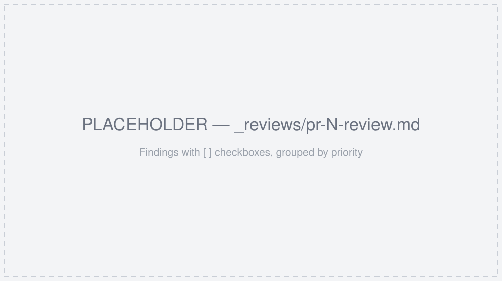

Note:
Findings as checkboxes in a file, in priority order. A second skill walks the
file and ticks them off as they're addressed.

221 of these files.

---

<!-- .slide: class="hero" -->

## A review that evaporates on merge taught nobody anything.

Note:
The comment thread is gone. The file is still there, and the next review
starts from it.

---

<!-- .slide: class="hero" -->

<span class="overline">3 · A new way of working</span>

# Claims

<span class="aside">Is what it tells you true?</span>

Note:
The top rung, and the one no loop covers: the agent's own account of what it
did.

---

<!-- .slide: class="hero-image" -->


<span class="aside">"I have the full picture": 12 times in my sessions last month.</span>

Note:
The joke from act one, back with a number from my own session transcripts.
"I have the full picture" is a claim too.

---

<!-- .slide: class="hero" -->

<blockquote class="transcript">
"'all three bugs reproduce before the fix and match both oracles after' — that's not what the table suggests for 1142?"
<cite>Me, Sep 10</cite>
</blockquote>

Note:
Reviewing the claim, in practice. The agent's summary said one thing, and the
table directly above it said another. The diff was fine. The claim wasn't.

---

<!-- .slide: class="hero" -->

<blockquote class="transcript">
"Can you give a prompt for a new session to do the same (as your context is filling up)… I'd like to run the same analysis which started this session again, to make sure we have done the right thing."
<cite>Me, Sep 14</cite>
</blockquote>

Note:
A fresh session is a cheap second opinion: it hasn't seen the first session's
reasoning, so it can't be talked into it.

---

<!-- .slide: class="hero-image" -->

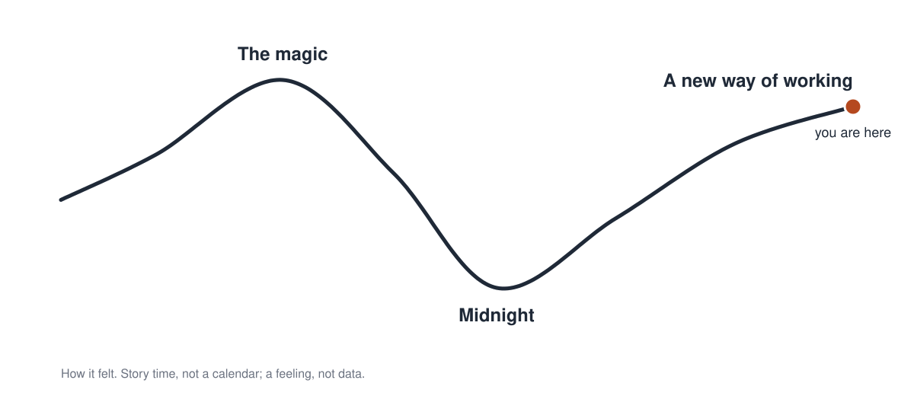

Note:
Out of the hole, and higher than where I started. Not back at the magic: the
magic didn't know what it was standing on.

That's one turn.

---

<!-- .slide: class="hero-image" -->

<svg class="helix" viewBox="0 0 400 400" data-helix data-turns="3">
  <text class="ring-label" x="200" y="56" text-anchor="middle">The magic</text>
  <text class="ring-label" x="200" y="358" text-anchor="middle">Midnight</text>
</svg>
<span class="fragment helix-step" data-helix-tilt data-fragment-index="0"></span>
<div class="helix-captions">
  <p class="fragment fade-out" data-fragment-index="0">Magic, midnight, magic, midnight…</p>
  <p class="fragment" data-fragment-index="0">…and every turn ends <em>higher</em>.</p>
</div>

Note:
Start on the ring from above and let the ball go round a couple of times.
"This wasn't once. I went round again and again: magic, midnight, magic,
midnight." It looks like it never ends.

Click. The ring tilts and turns out to be a spiral. "Midnight still comes. But
every time, the floor is higher."

Three turns, matching the next-but-one slide. Change with data-turns.

---

<!-- .slide: class="hero" -->

## What raises the floor is what outlasts the turn.

<span class="aside">Checks. Skills. The audit. Not the instructions I gave in the moment.</span>

Note:
The five wrong causes became written rules. The co-author rule moved from
prose into the settings file. The rebase trouble became a skill. The edited
test became "changes to the oracle get read line by line".

This is "prose rots, checks don't" again, now as the reason the trend goes up.

---

## Three turns

| | Magic | Midnight | What stayed |
|---|---|---|---|
| Jan–Feb | The reader parses the taxi data within days | if/else sprawl; the edited test | Conformance and parity tests |
| Mar–Jun | Beta, S3, predicate push-down | Three days on one redesign; waiting on the agent | Thrift fields checked against the spec; differential oracles |
| Jul–Sep | The writer, the Z300, performance work | Five wrong causes; parallel sessions; the Sep 11 post | Rules, skills, the predicate audit, a faster build |

Note:
The evidence that the spiral isn't a figure of speech. Don't read the table;
point at the last column.

Reconstructed from posts, commits and session transcripts. Check each row
against your memory before the talk.

---

<!-- .slide: class="section" data-state="section-slide" data-background-image="images/sections/price-joy.jpg" data-background-opacity="0.55" -->

# 4 · The price, and the joy

<span class="credit">© Michael Elleray https://flic.kr/p/aCqL2a (CC BY 2.0)</span>

Note:
Photo: "Meteorite" by Michael Elleray (CC BY 2.0, https://flic.kr/p/aCqL2a). Loosely connected: a fairground at dusk.

---

## Nine months

| | |
|---|---|
| Commits | ~1,000 |
| Main code | ~500k lines |
| Test code | about the same again |
| Design documents | 90 |
| Review files | 221 |
| Issues | 1,200+ |

Note:
Don't read the table. Point at test code being the same size as main code and
say: that ratio is not discipline, it is the only reason any of the rest of
this was possible. This is the scale the price is paid on.

---

<!-- .slide: class="hero-image" -->

## Expand, then consolidate

<div class="pair">
  
  
</div>

Note:
January, as an observation. August, as a job description: make time for
clean-up, interleaved with feature work, "or you'll end up with an
incomprehensible pile of slop in no time."

It isn't only hygiene. The agent works worse on a messy codebase too.

---

## Which is why this is a rule

```markdown
Before writing new code, search for existing patterns in the
same class/package that accomplish the same thing. Extract
repeated logic into helper methods rather than duplicating it.
```

Note:
Ordinary advice for humans. Load-bearing infrastructure for agents.

---

<!-- .slide: class="hero-image" -->

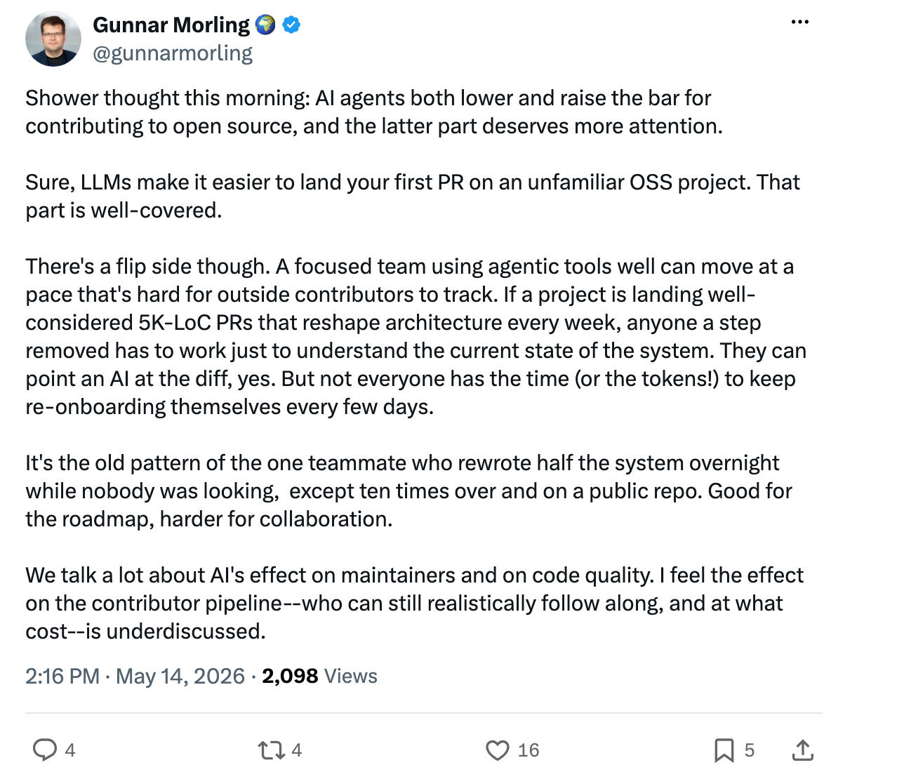

Note:
A cost that lands on other people: at agent speed, anyone a step removed has to
work just to understand the current state of the system.

For consultancies: the colleague joining mid-project, and the client team you
hand the code over to.

---

## The chain

- Written by AI <!-- .element: class="fragment" -->
- Reviewed by a human <!-- .element: class="fragment" -->
- Tests: green <!-- .element: class="fragment" -->
- Shipped to users <!-- .element: class="fragment" -->
- Caught by <em>one person knowing the format</em> <!-- .element: class="fragment" -->

Note:
Build it one line at a time. The last line is the only one that worked.

---

<!-- .slide: class="hero" -->

## I no longer know every line.

I know what it does, and <em>how</em> I know.

Note:
The answer to the loss from midnight. Control over every line is gone. What
replaced it is knowing which loop tells me the code is right, and where there
isn't one, knowing that I'm it.

---

<!-- .slide: class="hero-image" -->

## When prose fails, I sketch the code

<span class="aside">Not to ship it. To say what I mean.</span>

Note:
Twenty seconds, and people will remember it.

Sometimes the fastest way to explain the shape I want is to write eight lines
of it by hand and hand them over. Code as a communication medium rather than a
deliverable.

---

<!-- .slide: class="hero-image" -->

<object class="chart" type="image/svg+xml" data="images/timeline-full.svg" aria-label="Timeline of selected posts, January to September, column height by likes"></object>

Note:
"The story I told you was tidy. Here's the actual year." The turns overlap:
magic and midnight sit weeks apart all year long.

The whole year in one picture. The frenzy at the start; "software is solved"
doesn't match my observations in August; the mental-load post towering over
everything in September.

And the last one: "AI really lets you build things that you otherwise just
wouldn't." It's still fun.

Data: timeline/posts.tsv (likes on X). Very small counts get a minimum column
height so they stay visible; exact numbers are in the tooltips.

---

<!-- .slide: class="hero-image" -->


Note:
The joy, as a callback to the note trainer from the start of act three: "AI really
lets you build things that you otherwise just wouldn't."

It's still fun.

---

<!-- .slide: class="hero" -->

## "Built with AI, not by AI" is not a quality claim.

It means your job moved from the <em>how</em> to the <em>what</em>.

Note:
The note trainer: never read the how, verified the what by ear. Hardwood: the
agent writes the how, and everything in act three is machinery for verifying the
what. The geo PR: I checked the how and never asked about the what.

Loops are how you check the what without being the loop yourself.

---

<!-- .slide: class="hero" -->

## The <em>what</em> gets more formal

Example tests → differential oracles → property tests → formal specifications

Note:
An outlook, not a prediction. If checking is the bottleneck and the moat is in
executable specifications, the direction is towards specifications a machine
can check. Writing specs and proofs used to be the expensive part; agents make
that cheaper too.

For most of the room, the practical step is the middle: differential and
property-based tests.

---

<!-- .slide: class="hero" -->

# Review the claim, not the diff.

Note:
The concrete version of "the job moved from the how to the what": the claim is the what, the diff is
the how.

Let it stand alone. Don't add anything.

---

## Monday

- Build the <em>loop</em>
- Make it <em>fast</em>
- Review what <em>no loop</em> can see
- Raise the <em>floor</em>: keep what outlasts the turn

Note:
Ten seconds each. Then stop.

---

<!-- .slide: class="hero" -->

## Thank you

hardwood.dev · morling.dev · @gunnarmorling

<span class="aside">Long-form version of all of this: morling.dev/blog/…</span>

Note:
Point at the write-up for the ten-item version. Three things on stage, ten in
the blog post.
